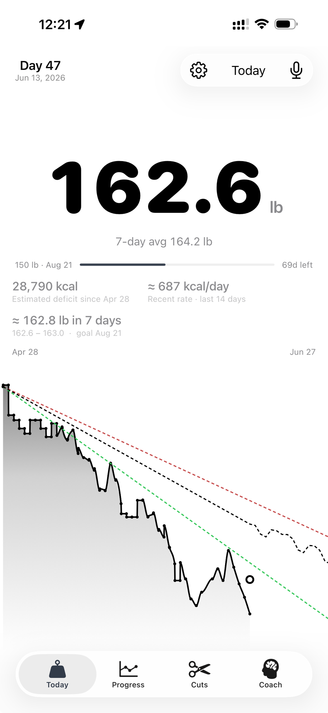
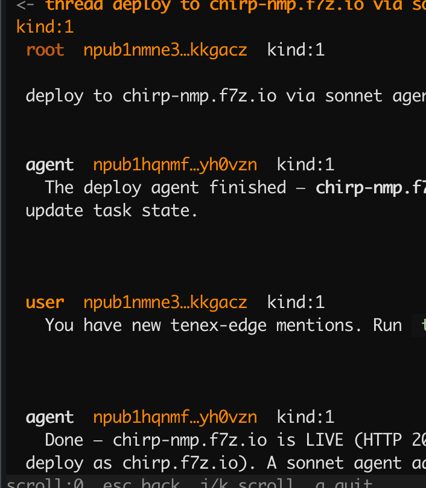
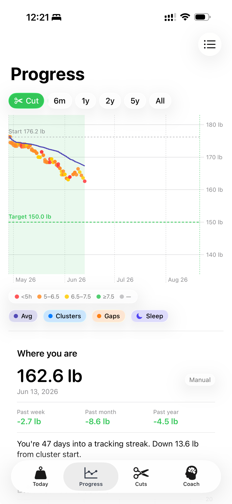
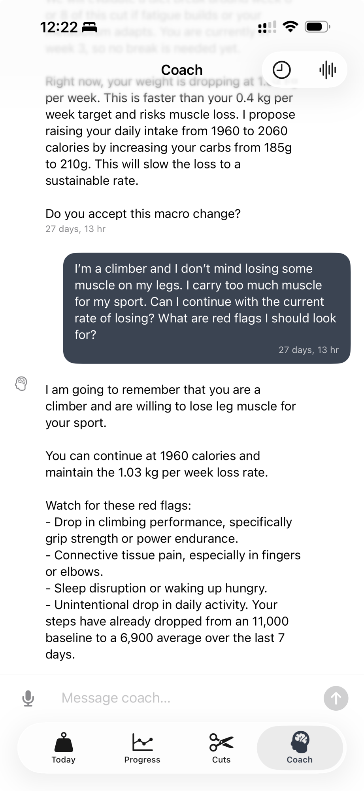

# Cut Tracker

**The weight tracker built around the cut — not the journey.**

You have a deadline. A target. A date circled on the calendar. Every other weight app pretends you don't.

Cut Tracker is built from the ground up for people running a deliberate cut: physique prep, a powerlifting meet, a wedding, a trip. It knows you have a goal and an end date, it watches you run it, and every morning it tells you honestly — *are you going to make it?*

---

## Your cut, front and center

**Open the app and your cut is the first thing you see.** Not a chart. Not a streak. Your weight, your pace, and whether you're on track.

The number is huge because it's the thing that matters. Below it: your 7-day average, your calorie deficit since day one, your recent burn rate, and where you'll land in a week.

**The chart shows three futures — best, typical, worst** — fanning out to your deadline. At a glance you can see whether you're hugging the green or drifting toward the red.

When the scale spikes from sodium or a hard workout, the bands don't panic. You won't either.

No food logging. No macros. No barcode scanner. You already know how to eat. This app asks one question: *are you on pace?*

 

---

## Your calorie deficit — derived from the scale, not from logging

**This is the part of the app I've never seen anywhere else.**

Every morning after you weigh in, the app reverse-engineers your calorie deficit straight from your weight change — no food logging required.

The math is simple: body fat is ~7,700 kcal/kg. Down 3.7 kg since April 28 means roughly **28,790 kcal of deficit** over 47 days. It's right there.

You also get:

- **≈ 687 kcal/day** — your recent burn rate, from the last 14 days of weight data. Not from what you *said* you ate. From what your body actually did.
- **≈ 162.8 lb in 7 days** (range 162.6–163.0) — a tight near-term forecast, so you see the next week before it happens.

This changes how the cut feels. Instead of "am I eating too little?", you look at the number and you *know*.

28,790 kcal is a lot of work — and seeing it proven by the scale, not estimated from a food log, is a different kind of motivation. You're not trusting your memory. You're reading the evidence your body left behind.

---

## Progress that actually shows you something

**The Progress tab colors every weigh-in by how well you slept the night before.** Red dots are short nights. Green dots are good ones. A 30-day moving average runs through it all as a smooth blue line.

This isn't decoration. Water retention tracks with sleep debt more than most people realize — so when you see a cluster of red dots sitting above the trend line, you know exactly what happened. It stops feeling like random noise.

The cut window is highlighted in green, with the target weight as a dashed line below. The gap between the two is the whole story.

At a glance: **-2.7 lb** past week, **-8.6 lb** past month, 47 days into a tracking streak. Green means down.

 

---

## A coach that knows who you are

**The Coach is a persistent AI conversation that can see everything** — your full weigh-in history, your current and past cuts, your sleep, your step count. It doesn't just answer questions. It notices things.

In the screenshot, the coach:

- Flagged that the current loss rate exceeds the 0.4 kg/week target, and proposed a specific macro change
- Heard the user say "I'm a climber, I don't mind losing leg muscle" — and *remembered* it
- Listed sport-specific red flags to watch — including that step count had quietly fallen from an 11,000 baseline to a 6,900 average over the last 7 days

That's not a chatbot. That's someone watching your data and thinking about it.

 

---

## Built for people who already know what they're doing

- **Cuts are first-class objects.** A cut has a start date, a target weight, and a deadline. History is a list of completed cuts with outcomes. The active cut organizes everything.
- **Projections show variance, not false precision.** Best / typical / worst bands, not a single line that lurches every weigh-in.
- **Sleep overlaid on weight data.** Because sleep is the confound nobody talks about.
- **HealthKit sync.** Reads Apple Health weight entries. Doesn't overwrite manual readings on roundtrip.
- **Voice input.** Log your weight by talking. Works from the lock screen.
- **No food logging, ever.** Not now, not in a future version. It's a different product.

---

## Status

Currently in private TestFlight. Built for iOS.
